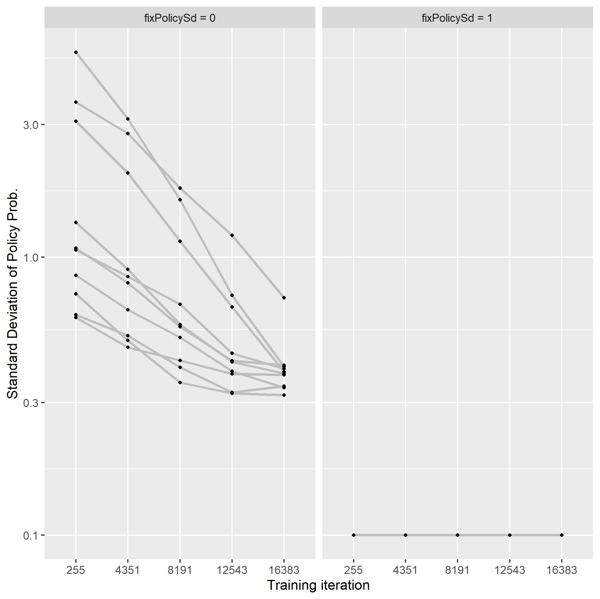
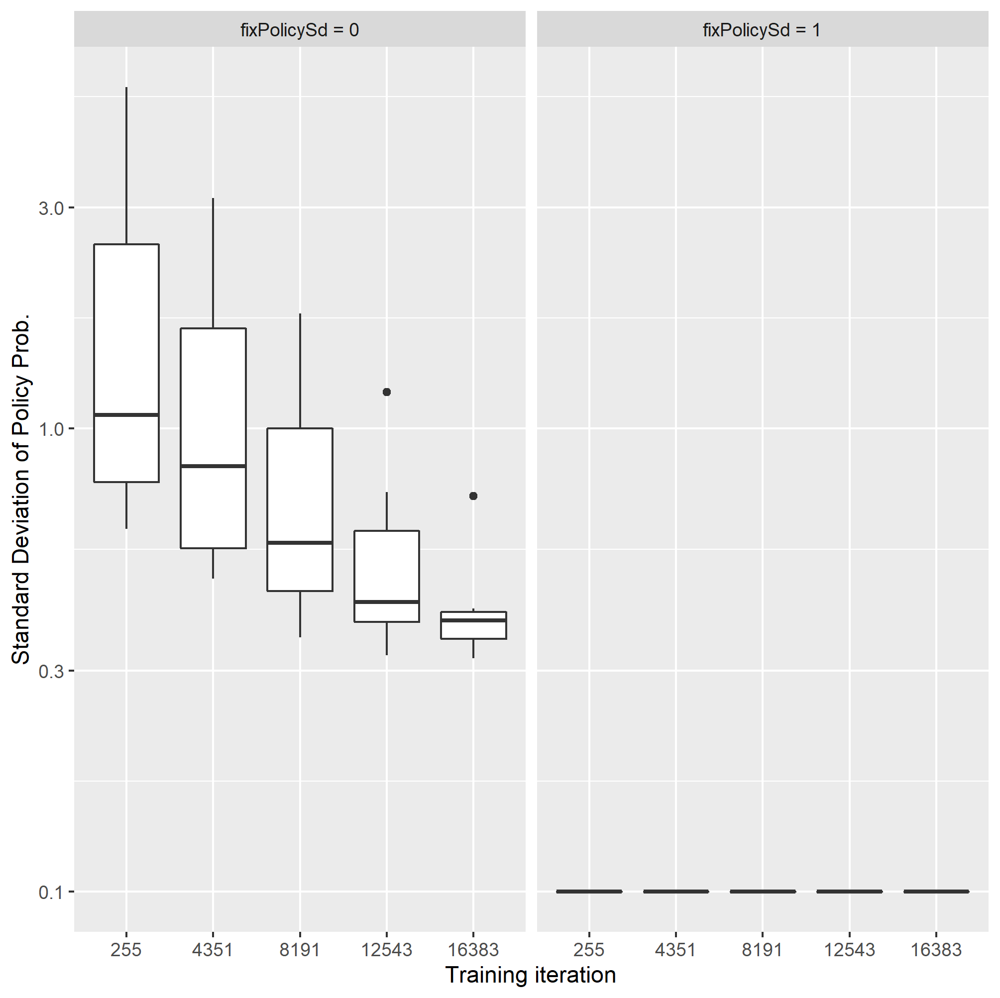
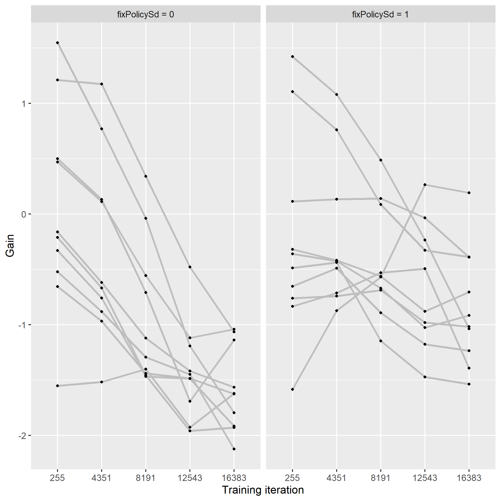
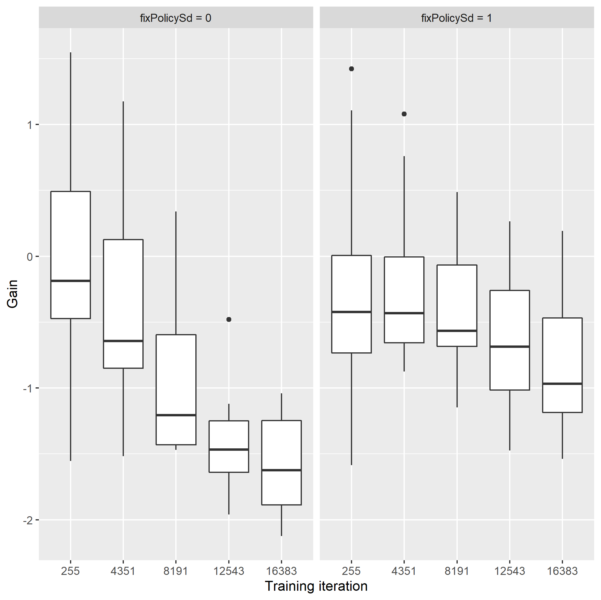
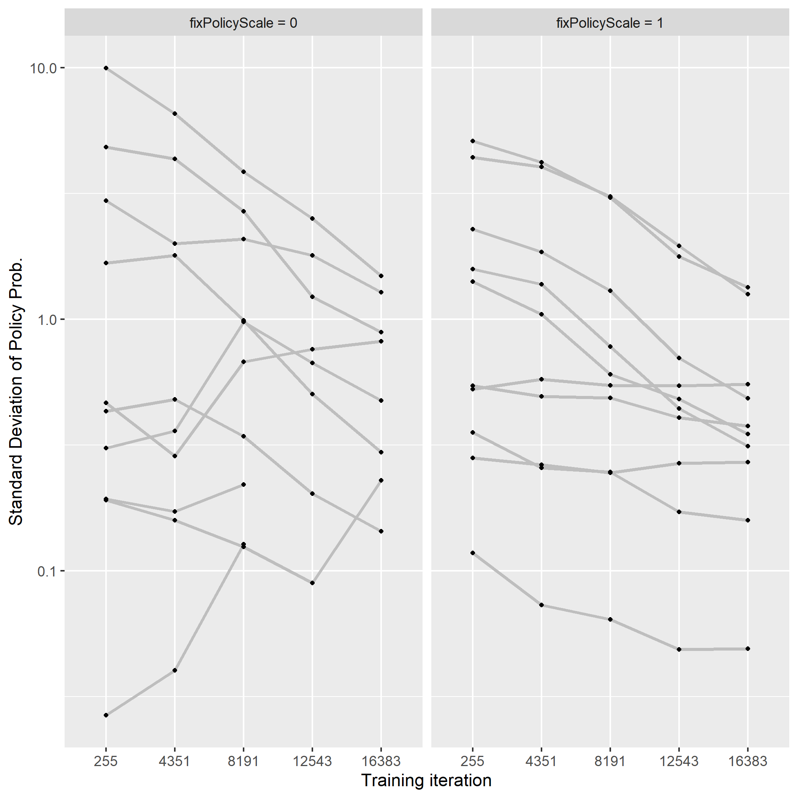
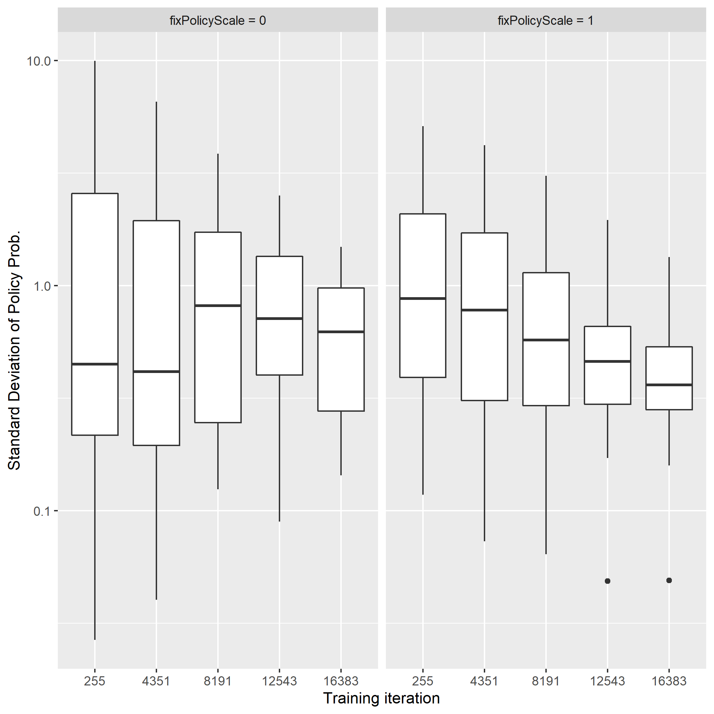
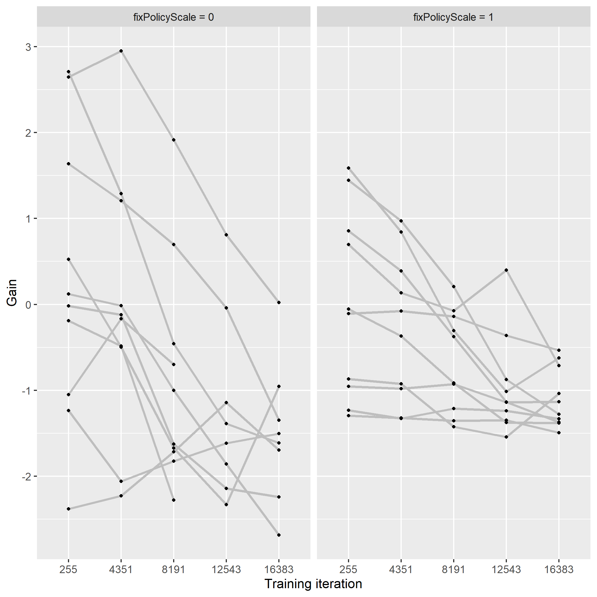
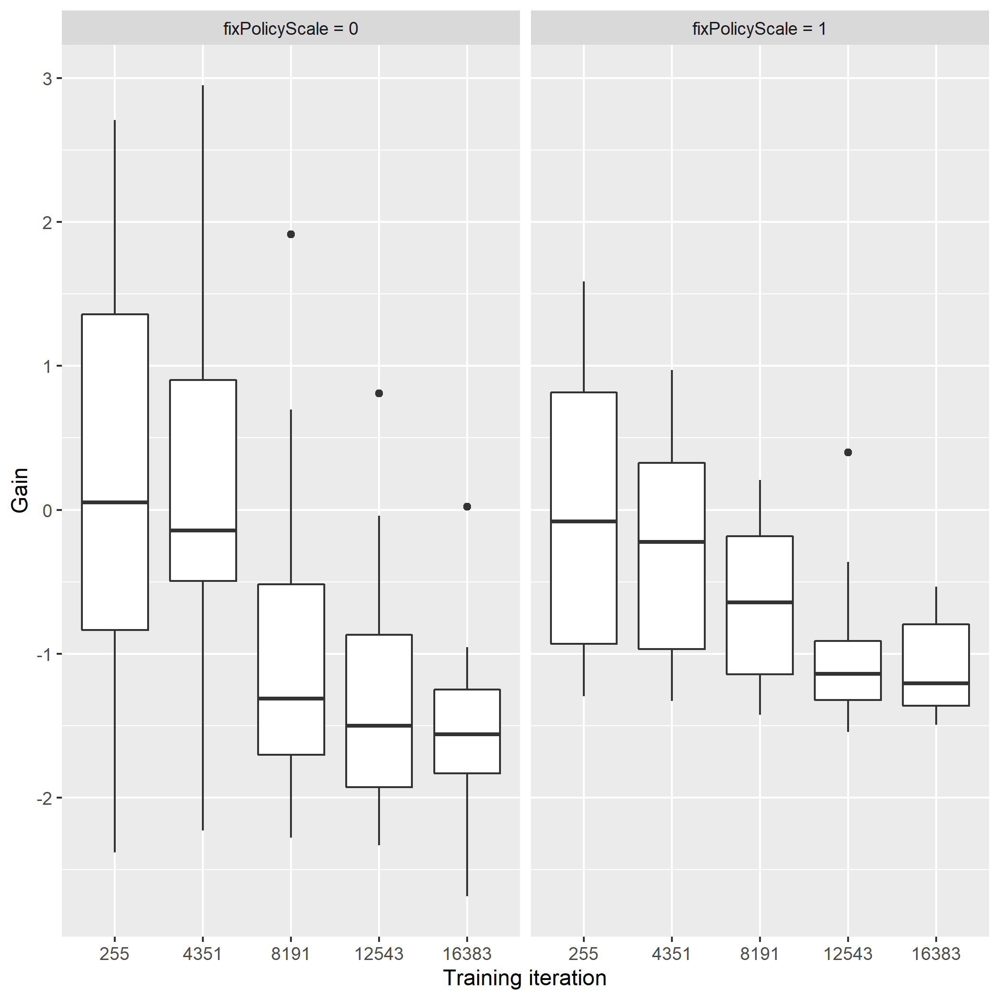
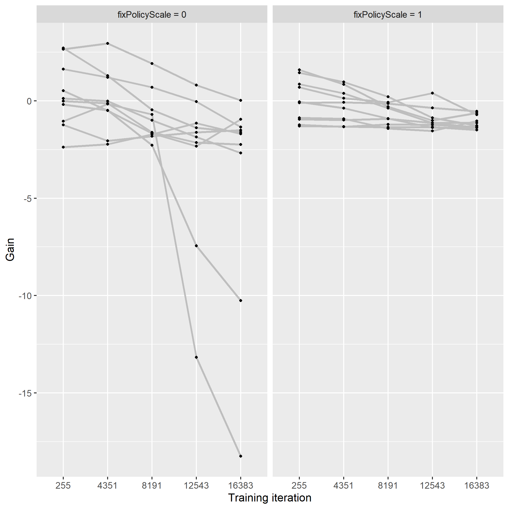

# Section 1: Introduction

The interest of this project is to find the feasibility of tuning the PID controller via the reinforcement learning framework.

This text is aimed at finding the optimal proportional gain of the controller to regulate the environment 
modelled by the first-order time-delay system with periodically switching stepwise disturbance
by using the Actor Critic methods.
This is a very basic study, though, it's possible to verify the validity of the parameter tuning RL (Reinforcement Learning)-aided procedures.

# Section 2: Problem Setting

## Agent

This study implemented the agent as the form of the P-controller, 
which means that 
- the agent output continuous actions,
- actions are proportional to observations of the environment with the constant proportional rate, so-called proportional gain.

Other than those features, 
- the agent adds random values following the normal distribution 
	- with a fixed standard deviation = 0.1 on actions
	- or with a variable one on actions, 
- actions pass through the hyperbolic tan function before being acted on the environment in order to make the tuning process stable.

## Environment

The features of the environment are followed as below:
- it's described by the first-order time-delay system with the fixed time constant = 10,
- it's driven 
	- by manipulating values given by the agent 
	- and also by disturbance switching from -1 to 1 and vice versa with the fixed interval = 30,
- it outputs the state variable as the observation.

Note that the observation is regarded as the error from the regulated value = 0, which will be minimized by the controller.

## Reward

Reward consists of the twofold parts:
- the absolute value of the observation(namely the error),
- the absolute value of actions.

It's the weight parameter on the error against the action, 
called just the weight parameter,
by which the two components are added.
For example, the value = 0.9 means prioritising the regulation of the error rather than the cost of action,
while the value = 0.1 means reducing the cost of action at the expense of high error.

## Return

Given the agent and the environment, Return is defined as either the expected value of the average of rewards along with the fixed length horizon = 8
or the expected one of the summation of the infinite reward series with the fixed discounting factor = 0.9.
The Actor Critic methods minimize the value of the Return 
so that the proportional parameter of the p-controller will be tuned according to the intention of the designer.

# Section 3: Case studies

It's supposed that the agents, namely P-controllers converges to the optimal one along with the training 
and that the larger the weight parameter is, the greater the optimal proportional gain is.
Here, these arguments will be confirmed.

## Subsection 3.1: case study #1

Given that the weight parameter = 0.9, 0.5, 0.1, 10 agents were trained, respectively, with the following hyper parameter.

Table 3.1.1 Training parameters
| name|value|
|:---:|:---:|
|both the value and the policy optimizer|Adam|
|learning rate for value optimization| 0.01 |
|learning rate for policy optimization| 0.001 |
|the interval of policy update| 16 |
| finite or infinite reward series | finite |
|reward horizon length | 8 |
| fix standard deviation of policy's probability | True|

The figure 3.1.1 shows the trace of gains along with the training for each value of the weight parameter, respectively.
You can notice that
- in all the case of the weight parameter, some of proportional gains are converging, 
- in the others, the majority of which started from the positive gain, the gain increases rather than go below the zero-axis.

Fig.3.1.1 The proportional gains over the training process

The figure 3.1.2 shows the distributions of the proportional gains for each weight parameter at the training iterations.
It shows that the median of the converged gains becomes less with the higher weight on the error in the reward.
This means that the P-controller with the higher weight parameter responses against the stepwise disturbance more quickly.

Fig.3.1.2 The proportional gains over the training process

## Subsection 3.2: case study #2

This case study used the optimizer: RMSprop instead of the optimizer: Adam as the case study #1 used.
As the former optimizer was applied to the reinforcement learning in some papers, 
the optimizer might have been effective for the convergence of the proportional gain.
That's why the difference of the optimizers was verified, here.
More precisely, the training parameters were set as summarised in the table 3.2.1.

The results of the trained gains are shown in the figure 3.2.1 and 3.2.2.
They tell us that the optimizer: RMSporp cannot make sense for improving the convergence.

Table 3.2.1 Training parameters
| name|value|
|:---:|:---:|
|both the value and the policy optimizer|RMSprop|
|learning rate for value optimization| 0.01 |
|learning rate for policy optimization| 0.001 |
|the interval of policy update| 16 |
| finite or infinite reward series | finite |
|reward horizon length | 8 |
| fix standard deviation of policy's probability | True|

Fig.3.2.1 The proportional gains over the training process

Fig.3.2.2 The proportional gains over the training process

## Subsection 3.3: case study #3

In the contrast to the case studies #1 and #2,
the return was given by the summation of the infinite reward series with the discounting factor: gamma = 0.9
, which is equivalent to the moving average with the fixed window length = 10.
The length of the reward horizon = 8 of both the case studies #1 and #2 is enough long to cover the effect of the actions
and the result of the training does not differ from the case studies #1 and #2,
though, it's beneficial to train agents since the interval of policy update can be shrunk from 16 to 2.

The training parameters in the table 3.3.1 shown below were used.
The figure 3.3.1 and the figure 3.3.2 are the traces of the trained proportional gains.
Beyond the expectation, the summation of the infinite reward series with the discounting factor can lead to better convergence.
Especially, in the case with the weigh parameter = 0.1, the gain has already converged
and in the rest of the cases, it's possible to see that the gains are approaching to the converged one.
I'm struggling with the reason.

Table 3.3.1 Training parameters
| name|value|
|:---:|:---:|
|both the value and the policy optimizer|Adam|
|learning rate for value optimization| 0.01 |
|learning rate for policy optimization| 0.001 |
|the interval of policy update| 2 |
| finite or infinite reward series | infinite |
| gamma | 0.9 |
| fix standard deviation of policy's probability | True|

Fig.3.3.1 The proportional gains over the training process

Fig.3.3.2 The proportional gains over the training process

## Subsection 3.4: case study #4

Seeing the result of the case study #3,
the convergence with the largest weight parameter should be made efforts to improve
since the gains with the weight parameter = 0.5 or 0.1 have converges better.
Thinking that with larger weight parameter the priority on the error becomes larger rather than the action, 
it's normal to take longer time to approach the optimal solution.
From now on, let think the case with the weight parameter = 0.9, more intensively.

In all the case study #1, #2 and #3, the standard deviation of the policy's probability has been fixed,
though, regarding it as a tunable parameter in a neural network and tuning it through trainings are normal in the context of the actor critique learning.
It may be more efficient because the variable standard deviation can lead to better exploration and then better acceleration.

In this case study 4, 
agents were trained under the training parameter shown in the table 3.4.1.
Note,
- weight parameter, so-called, weightOnError is fixed at 0.9,
- the iteration number was doubled to all the previous case studies(#1, #2 and #3).

The figure 3.4.1(a) and (b) show the convergence of the trained standard deviations over the trainings and its boxplots.
While the values of the standard deviation are fixed with "fixPolicySd = 1" at 0.1,
its values with "fixPolicySd = 0" are decreasing as training proceed, however,
it has reached at the larger value, say near 0.4.

The figure 3.4.2(a) and (b) show the development of the trained proportional gains over the training process.
With the case of the tunable standard deviation: "fixPolicySd = 0",
they converged more rapidly and with slightly more stable.
It's probably because the higher trained standard deviations all over the training process
cause to speed up the convergence.
It might be interpreted that the higher standard deviation and then the wider exploration can lead to the better convergence.

Table 3.4.1 Training parameters
| name|value|
|:---:|:---:|
|both the value and the policy optimizer|Adam|
|learning rate for value optimization| 0.01 |
|learning rate for policy optimization| 0.001 |
|the interval of policy update| 2 |
| finite or infinite reward series | infinite |
| gamma | 0.9 |
| weightOnError | 0.9 |
| fix standard deviation of policy's probability | True or False |

Fig.3.4.1(a) The standard deviation of the policy's probability over the training process

Fig.3.4.1(b) The standard deviation of the policy's probability over the training process

Fig.3.4.2(a) The proportional gains over the training process

Fig.3.4.2(b) The proportional gains over the training process

## Subsection 3.5: case study #5 Multipy the gain with the logscaled parameter

The uncertainty of scale is a concern in the reinforcement learning framework.
For example, in this case, the reward on the steady state increases almost with the proportion to the inverse of gain.
Seeing that the parameters are updated linearly, it can take much iteration to obtain more reward.

Adopting a logarithmic scale parameter: logScale is one way to mitigate the concern.
More precisely, the agent outputs the action: `u` in a normal way and then
the action is multiplied by the exponent of the scale parameter, say `exp(logScale)*u`,  before acting on the environment.
Thanks for updating the parameter in the logarithmic scale, it can be expected that it converges more fast.

The agents were trained by using the training parameters in the table 3.5.1.
The figure 3.5.1(a) and (b) show the training process of the standard deviation of the agents.
And the trained gains are shown in the figure 3.5.2(a) and (b).
Note that the "outlier" cases, where the gains were below the threshold: -3, are omitted from the above figures
and you could see all the trained gains in the figure 3.5.3. 
The "outlier" cases would not be taken into account in the later description.

The results of the standard deviations of the agents tell us that 
the cases with the tunable logarithmic scale: "fixPolicyScale = 0" can lead to, 
even beginning with the large variety of the exploration, 
converging as fast as the cases with the fixed scale: "fixPolicyScale = 1".

In the case of gain, the same thing can be observed 
and the gains with the tunable scale evolve faster than the ones with the fixed scale.
However, 
as mentioned before about the figure 3.5.3, the training process is sometime sucked down an unstable state
since the gains are updated too rapidly.
Extra regularization terms should have been added to the reward.

Table 3.5.1 Training parameters
| name|value|
|:---:|:---:|
|both the value and the policy optimizer|Adam|
|learning rate for value optimization| 0.01 |
|learning rate for policy optimization| 0.001 |
|the interval of policy update| 2 |
| finite or infinite reward series | infinite |
| gamma | 0.9 |
| fix standard deviation of policy's probability | False |
| fix scale of policy's probability | False or True |

Fig.3.5.1(a) The standard deviation of the policy's probability over the training process without outliers

Fig.3.5.1(b) The standard deviation of the policy's probability over the training process without outliers

Fig.3.5.2(a) The proportional gains over the training process without outliers

Fig.3.5.2(b) The proportional gains over the training process without outliers

Fig.3.5.3 The proportional gains over the training process with outliers

# Summary:

In this text,
the effects of some useful tips were confirmed
by  using the pair of the first-order time-delay environment
and the proportional gain controller agent.
