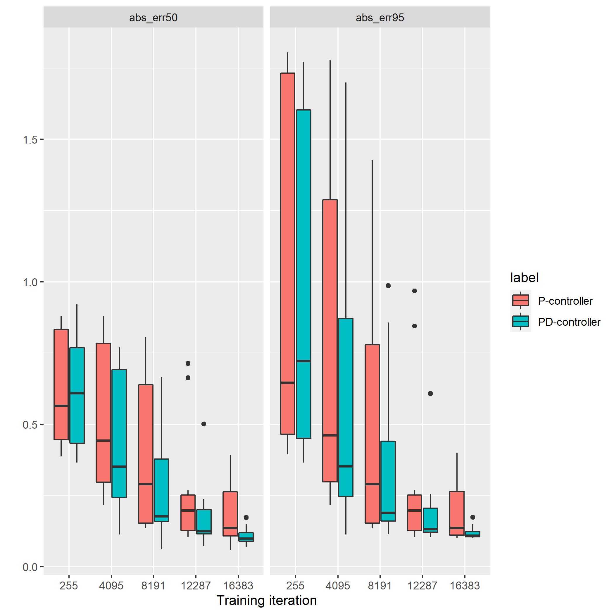

# 1. Introduction
In the following case studies,
the effect of PD-controller is investigated 
by comparing the behaviours between the system controlled by P-controller
and the ones contorlled by PD-controller.

It's supposed that 
the response against stepwise disturbance 
is improved by the derivative factor
since any abrubt change of error amplifies the action
via the derivative factor and the stepwise error can be diminished more quickly  than in the case of controlling by P-controller.

In this short text,
the responsiveness of the PD-controller is compared with the one of the P-controller
and also we see how the responsiveness depends on the hyperparameter of the Reinforcement Learning
and finally we look through the counter effect of higher responsiveness.

# 2. Specifications

## 2-1. Agent, namely Controller
The specification of agent is here.
Action consists of the following twofold,
the proportional term obtained by multiplying a value of error by a proportional gain
and the derivative term obtained by multiplying a derivative gain and a value of slope over the specific length time series of error, 
where the length of the series of errors is specified by a parameter: $nSeq$.

# 3. Highlights of case studies
The case studies shown in this text are hilighted as follow:
- The case study #1 compares the behaviours of P- and PD-controller with a set of hyper parameter by observing trends of response to the stepwise disturbance.
- The case study #2 shows the diffrence depending on the discount factor, one of the reinforcement learning hyperparameter, which controls the weight on the reward over the time horizon, more precisely say that the closer the discount factor is to 1 and the longer the time horizon is and then, less quickly the agent responses against the error.
- The case study #3 looks through the effect of the regularation parameter in order to investigate the expense of the responsiveness of controller.

# 4. Case studies

## 4-1. Case study #1: 

This case study compares the behaviours of systems controlled by P- and PD-controller, respectively.
The set of hyper parameters for the reinforcement learning is shown in the table 4.1.1.
All the parameters used in the training except the parameter to enable the derivative factor are same between the two controller.
Around 10 agents were trained for P-controller and PD-controller, respectively
in order to mitigate the uncertainty of trained controller parameters caused by the reinforcement learning.

The learning curves for the two controllers can be seen in the figure 4.1.1.
The performance of agent are evaluated by the following measurements of the error caused by the stepwise disturbance:
- 95 percentile of the absolute value of the error, of which the value approximates the peak absolute value of the error except outliers
- and 50 percentile of the absolute value of the error, of which the value approximates the average absolute value of the error except outliers.
It's confirmed that the performances for the two controllers have been enough converged after the training iteration.

The figure 4.1.2 shows the simulation results of two systems, the one cotrolled by a trained P-controller
and the other by a trained PD-controller, where the controllers withe the medium performance are selected.
The two pairs of the action and the error trend observed in the figure mean the responses against the stepwise disturbance
for the two systems, respectively.
It's observed that the rise time of the error in the case of PD-controller is shorter than the one in the case of P-controller.
This means that the derivative factor contributes to the better responsiveness.

Table 4.1.1 Hyperparameters used in trainings
|name| description | value |
|:----:|:----:|:----:|
| gamma | reward discount factor | 0.9 |
| nSeq | the length of series to calculate derivative | 5 |
| weightOnError | controls the priority against the regularization term  | 0.99 |
| agentEnableDcomponent | False or True |

 
Figure 4.1.1: Learning Curves

 
Figure 4.1.2: Simulation result of the response against the stepwise disturbance
