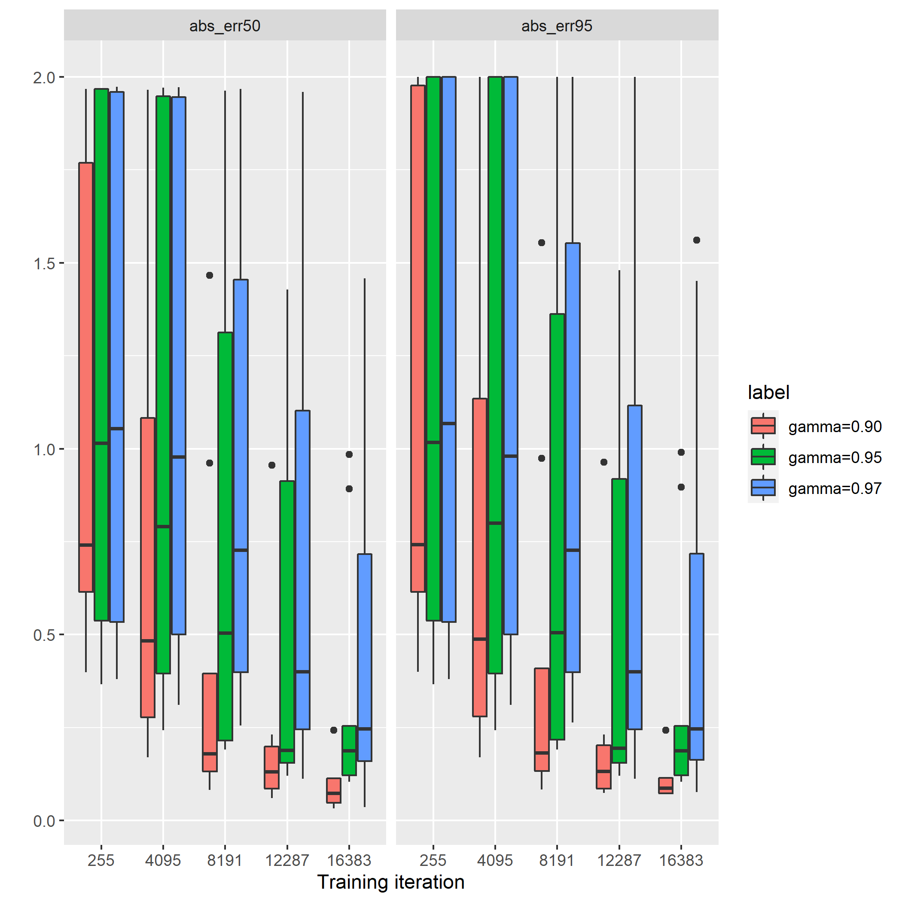

# 1. Introduction
In the following case studies,
the effect of PD-controller is investigated 
by comparing the behaviours between the system controlled by P-controller
and the ones contorlled by PD-controller.

It's supposed that 
the response against stepwise disturbance 
is improved by the derivative factor
since any abrubt change of error amplifies the action
via the derivative factor and the stepwise error can be diminished more quickly  than in the case of controlling by P-controller.

In this short text,
the responsiveness of the PD-controller is compared with the one of the P-controller
and also we see how the responsiveness depends on the hyperparameter of the Reinforcement Learning.

# 2. Specifications

## 2-1. Agent, namely Controller
The specification of agent is here.
Action consists of the following twofold,
the proportional term obtained by multiplying a value of error by a proportional gain
and the derivative term obtained by multiplying a derivative gain and a value of slope over the specific length time series of error, 
where the length of the series of errors is specified by a parameter: $nSeq$.

# 3. Highlights of case studies
The case studies shown in this text are hilighted as follow:
- The case study #1 compares the behaviours of P- and PD-controller with a set of hyper parameter by observing trends of response to the stepwise disturbance.
- The case study #2 shows the diffrence depending on the discount factor, one of the reinforcement learning hyperparameter, which controls the weight on the reward over the time horizon, more precisely say that the closer the discount factor is to 1 and the longer the time horizon is and then, less quickly the agent responses against the error.
- The case study #3 looks through the effect of the regularation parameter in order to investigate the expense of the responsiveness of controller.

# 4. Case studies

## 4-1. Case study #1: 

This case study compares the behaviours of systems controlled by P- and PD-controller.
The set of hyper parameters for the reinforcement learning is shown in the table 4.1.1.
All the parameters used in the training except the parameter `agentEnableDcomponent`, 
which controls using the derivative factor or not, 
are same between the two controllers.
Around 10 agents of P-controller and PD-controller were trained, respectively, 
in order to mitigate the uncertainty of trained controllers' parameters caused by the reinforcement learning.

The learning curves of performances for the two controllers can be seen in the figure 4.1.1.
The performances of agent are evaluated by the following features of the error caused by the stepwise disturbance:
- 95 percentile of the absolute value of the error, of which the value approximates the peak absolute value of the error except outliers
- and 50 percentile of the absolute value of the error, of which the value approximates the average absolute value of the error except outliers.

It's confirmed that the performances for the two controllers have been enough converged at the end of the training iterations.

The figure 4.1.2 shows the simulation results of the two systems, the one controlled by a trained P-controller
and the other controlled by a trained PD-controller, where each controllers are selected among the trained ones with the medium 50 percentile absolute error.
The figure contains the two pairs of the action and the error trend of the responses against the stepwise disturbance.
It's observed that the rise time of the error in the case of PD-controller is shorter than the one in the case of P-controller.
This means that the derivative factor contributes to the better responsiveness.

Table 4.1.1 Hyperparameters used in trainings
|name| description | value |
|:----:|:----:|:----:|
| gamma | reward discount factor | 0.9 |
| nSeq | the length of series to calculate derivative | 5 |
| weightOnError | controls the priority against the regularization term  | 0.99 |
| agentEnableDcomponent | control the type of controller between P- or PD-controller | False or True |

 
Figure 4.1.1: Learning Curves of the error against the stepwise disturbance

 
Figure 4.1.2: Simulation results of the responses against the stepwise disturbance for P- and PD-controller, respectively

## 4-2. Case study #2:

Here, we study hyperparameter of the reinforcement learning to influence the responsiveness against the error.
It's supposed to choose the discount factor, `gamma` because of the following reason.
First of all, the discount factor controls the priority of rewards alongside the time horizon, 
in fact, seeing the definition of the discounted infinite sum of rewards,
if the discount factor closes to 1 then, agents are oriented to the long term reward.
In the constrast, with the smaller discount factor, still non negative, 
agent seek for the short-term reward by diminishing the error as quickly as possible
at the expense of large actions.
That's the reasoning behind choosing the discount factorm as the control parameter of the responsiveness.

The set of hyperparameters used in the trainig is shown in the table 4.2.1.
Given that the discounting factor can be given as `1-1/T`, where `T` denotes the time constant of moving average of rewards,
the options of the discount factors, 0.9, 0.95 and 0.975 are according to T = 10, 20 and 40, respectively.
This interpretation enables easier understanding of the discount factor,
in fact, the time constant can directly control the rise time of the response against the stepwise error.

The figure 4.2.1 shows the learning curve of the trained agents as mentioned in the case study 1.
All the performances of trained agents have been enough saturated, however,
the agents with the discount factor closer to 1 are likely to converge more slowly.

The simulated response of closed loop system controlled by instances selected from trained agents as in the case study 1
are shown in the figure 4.2.2.
The rise time of the response against stepwise disturbance controlled by trained agents 
are shown in the figure 4.2.3.
Both results tell us that,
with the discount factor closer to 1, namely the longer time constant, 
the rise time is longer.

Table 4.2.1 Hyperparameters used in trainings
|name| description | value |
|:----:|:----:|:----:|
| gamma | reward discount factor | 0.9, 0.95 and 0.975 |
| nSeq | the length of series to calculate derivative | 5 |
| weightOnError | controls the priority against the regularization term  | 0.99 |
| agentEnableDcomponent | control the type of controller between P- or PD-controller | True(PD-controller only) |

 
Figure 4.2.1: Learning Curves

 
Figure 4.2.2: Simulation results of the responses against the stepwise disturbance for the given discount factors, respectively

 
Figure 4.2.3: Rise times 

## 4-3. Case study #3:

In the context of control theory,
the regularization term, which is usually defined as the norm of manipulation values,
often serves the restriction of the abrupt change of the action
and then leads to less sensitive controller against disturbances.

The weight parameter, which is the proportional rate to combine the two reward components, say, 
the absolute value of the error and the one of the action, can work as the regularization parameter.
Here, we study how the weight parameter affects the responsiveness against the disturbance and 
how it stabilises learning processes.

The following two environments are considered.
- the environment with the stepwise disturbance,
- and the one with the stepwise disturbance and also the gaussian distributed noise.
Thinking about the second environment can not be skipped
because the counter effect from less regularization, which is the vulnarability against the gaussian distributed noise, should be checked.

The hyperparameters used in the training are shown in the table 4.3.1.
The weigt parameter, namely `weightOnError`, is chose from the three options,
where with the value closer to 1 the regularization gets smaller.

The learning curves of the trained parameters of policy  are shown in the figure 4.3.1(a),(b) and (c).
And the figure 4.3.2(a) and (b) shows the learning curves of the performances of the trained agents,
the magnitude of the error in the first and the rise time in the later.
We observe as follows.
- For all the cases, whether with or without the gaussian distributed noise or however small the regularization terms are, the training processes are converged. Though, in the case with the least regularization term, the learnings with the gaussian distributed noise are more stable than the ones without the noise.
- When the regularization term goes smaller, the magnitudes of the proportional and derivative gains without the gaussian distributed noise become larger, which means that trained controllers response against the disturbance more quickly. The same thing can be confirmed in the gains trained under the environment with the noise. Comparing the gains tuned under environments without and with the noise, the absolute values of the first are larger than the ones of the later.
- Rise times are very unstable and vulnable against the regularizationterm and the gaussian distributed noise generated in the environment. As alread mentioned in the above item, with the lighter regularization, generally speaking, we can acquire faster controller, however, the peformance of the quickness varies inside the single fixed parameter set.

The first finding can interestingly imply that
the regularization term can be replaced by the disturbance of the environment
and furthermore that, thiking that noises are generally accompanied with environments,
it's not mandate to add the regularization term in the reinforcement learning framework.
And according to the third finding, it's hard to evaluate the responsiveness against the stepwise disturbance
by using the rise time. This criteria is too sensitive to trained parameters.

Table 4.3.1 Hyperparameters used in trainings
|name| description | value |
|:----:|:----:|:----:|
| gamma | reward discount factor | 0.9 |
| nSeq | the length of series to calculate derivative | 5 |
| weightOnError | controls the priority against the regularization term  | 0.5, 0.9 or 0.99 |
| amplitudeDv | standard deviation of gaussian noise | 0 or 0.1 |
| agentEnableDcomponent | control the type of controller between P- or PD-controller | True(PD-controller only) |

 
Figure 4.3.1(a): the learning curve of the trained derivative gains

 
Figure 4.3.1(b): the learning curve of the trained proportional gains

 
Figure 4.3.1(c): the learning curve of the trained standard deviation of the noise generated by agents

 
Figure 4.3.2(a): the learning curve of the error

 
Figure 4.3.2(b): the learning curve of the rise time
